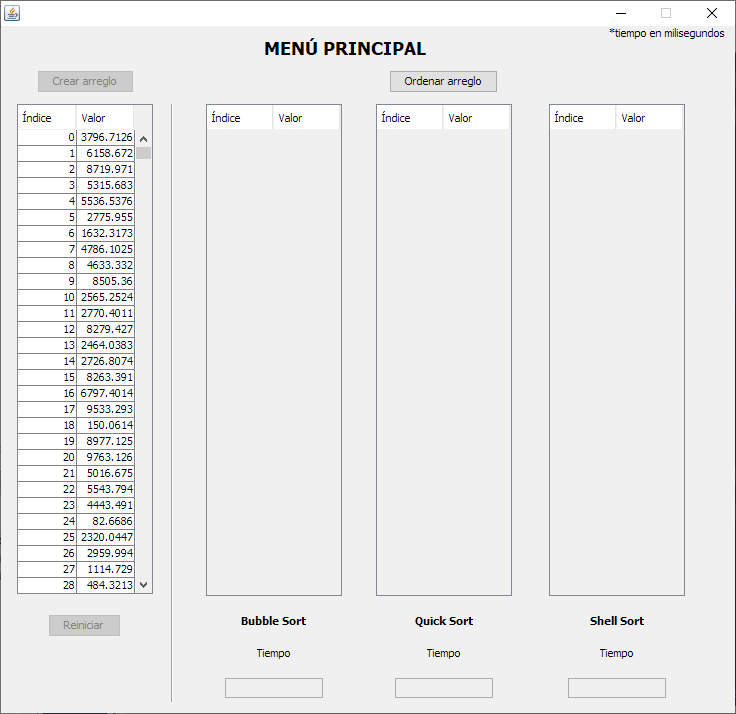
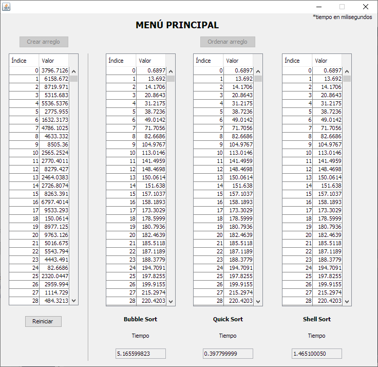

# Métodos de ordenación en Java

Este programa ordena un arreglo de 1000 (mil) posiciones con números REALES aleatorios entre el 0 al 10.000 (diez mil).

## Métodos de ordenación utilizados

* Burbuja
* QuickSort
* ShellSort

##  Consideraciones

* Realizado en lenguaje de programación Java
* JDK 8
* Netbeans 8.2
* Windows 10

## Capturas

**Menú principal**

**Generación del arreglo desordenado**

**Arreglo ordenado y tiempo de ejecución en milisegundos**

